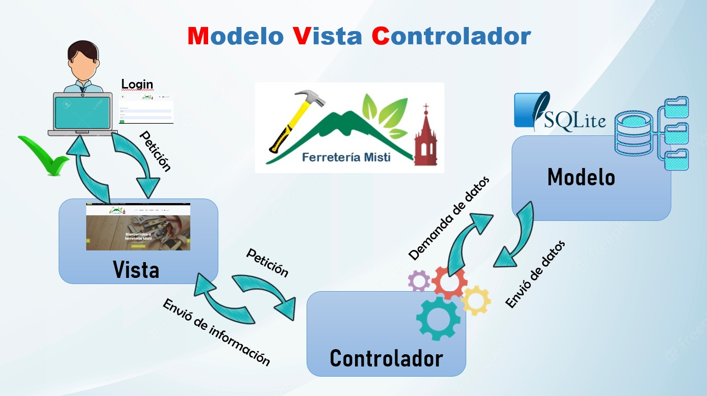
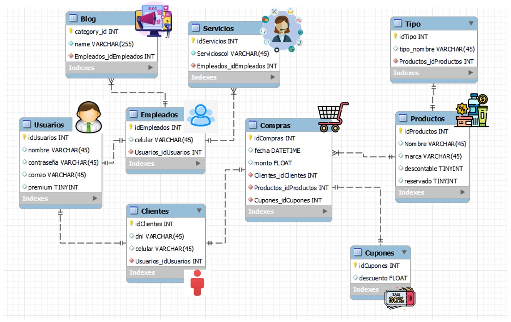
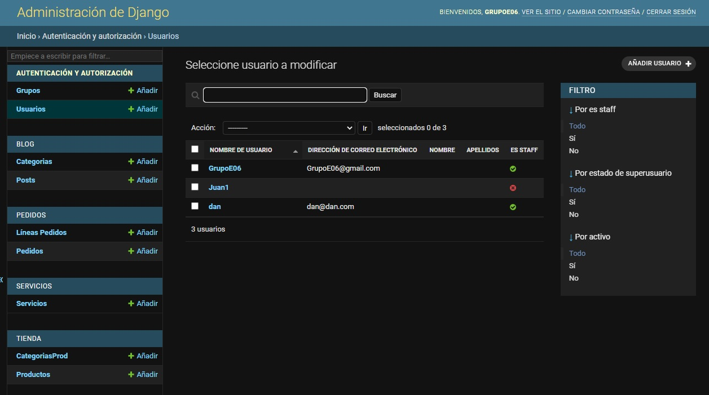
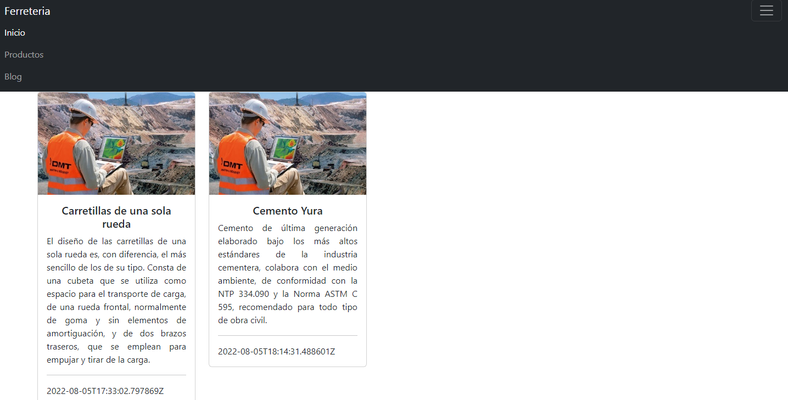
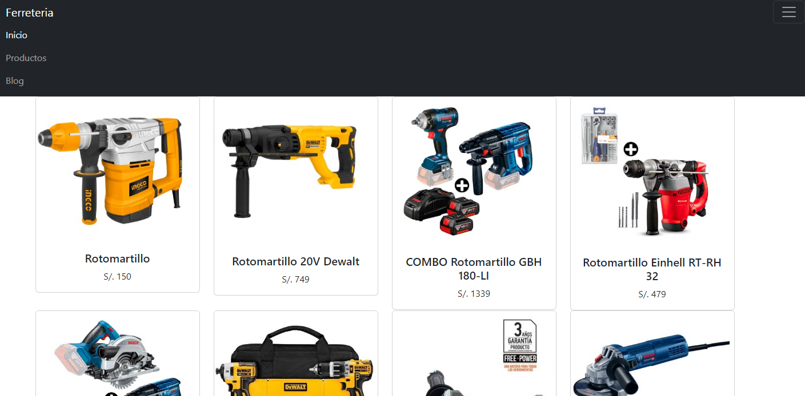

<div align="center">
<table>
    <theader>
        <tr>
            <td></td>
            <th>
                <span style="font-weight:bold;">UNIVERSIDAD NACIONAL DE SAN AGUSTIN</span><br />
                <span style="font-weight:bold;">FACULTAD DE INGENIERÍA DE PRODUCCIÓN Y SERVICIOS</span><br />
                <span style="font-weight:bold;">ESCUELA PROFESIONAL DE INGENIERÍA DE SISTEMAS</span>
            </th>
            <td></td>
        </tr>
    </theader>
    <tbody>
        <tr><td colspan="3"><span style="font-weight:bold;">Formato</span>: Guía de Práctica de Laboratorio / Talleres / Centros de Simulación</td></tr>
        <tr><td><span style="font-weight:bold;">Aprobación</span>:  2022/03/01</td><td><span style="font-weight:bold;">Código</span>: GUIA-PRLE-001</td><td><span style="font-weight:bold;">Página</span>: 1</td></tr>
    </tbody>
</table>
</div>

<div align="center">
<span style="font-weight:bold;">INFORME DE LABORATORIO</span><br />

<table>
<theader>
<tr><th colspan="6">INFORMACIÓN BÁSICA</th></tr>
</theader>
<tbody>
<tr><td>ASIGNATURA:</td><td colspan="5">Progamación Web 2</td></tr>
<tr><td>TÍTULO DE LA PRÁCTICA:</td><td colspan="5">Proyecto Web - Ferreteria Online</td></tr>
<tr>
<td>NÚMERO DE PRÁCTICA:</td><td>08</td><td>AÑO LECTIVO:</td><td>2022 A</td><td>NRO. SEMESTRE:</td><td>III</td>
</tr>
<tr>
<td>FECHA DE PRESENTACIÓN:</td><td>23/08/2022</td><td>HORA DE PRESENTACIÓN: 12:00 pm</td><td colspan="3"></td>
</tr>
<tr><td colspan="3">INTEGRANTE(s):
<ul>
      <li><a href="https://github.com/Daunsa">Daniel Edwad Tapia Saenz</a></li>
			<li><a href="https://github.com/timysuclle3">Michael Benjamin Suclle Suca</a></li>
			<li><a href="https://github.com/Jerbo03">José André Paredes Quispe</a></li>
			<li><a href="https://github.com/Icielo23">Valery Cielo Iquise Mamani</a></li>
			<li><a href="https://github.com/Mario-Chura">Mario Franco Chura Puma</a></li>
</ul>
</td>
<td>NOTA:</td><td colspan="2"></td>
</<tr>
<tr><td colspan="6">DOCENTE(s):
<ul>
<li>Richart Smith Escobedo Quispe - rescobedoq@unsa.edu.pe</li>
</ul>
</td>
</<tr>
</tbody>
</table>
</div>

#   WebApp con Django

[![License][license]][license-file]
[![Downloads][downloads]][releases]
[![Last Commit][last-commit]][releases]

[![Debian][Debian]][debian-site]
[![Git][Git]][git-site]
[![GitHub][GitHub]][github-site]
[![Vim][Vim]][vim-site]
[![Java][Java]][java-site]

- La estrutura del proyecto es la siguiente:


 	  	

		    ├── PW2-22A-GrupoE06-Proyecto-Ferreteria_Online
		    │   ├── ferreteriaOnline
		    │   │    ├── autenticacion
		    │   │    |── blog
		    │   │    ├── carro
		    │   │    |── contacto
		    │   │    ├── ferreteriaOnline
		    │   │    |── ferreteriaOnlineApp
		    │   │    |── media
		    │   │    ├── pedidos
		    │   │    |── servicios
		    │   │    ├── tienda
		    │   │    ├── manage.py
		    │   │    └── db.sqlite3
		    │   │
		    │   ├── .gitignore
		    │   │
		    │   ├── README.md
		    │   │
		    │   |__ requirements.txt
		    │   
		    └── README.md

##  ***___1. Tipo de Sistema___***

Se desarrolló una aplicación web construida con el framework Django 4, Bootstrap y REST, el cual permitirá al dueño de una ferretería (Ferretería Misti) a poder ofrecer sus servicios en línea donde podrá poner sus productos a la venta, promociones, servicios adicionales y recibir pedidos los cuales serán preparados para que el cliente venga a recogerlo.


- 1.El navegador nos muestra una vista de la portada principal de la ferretería donde se ofrecen los productos, pero no se podrá agregar productos al carro de compras si no se está registrado.
	
- 2.Una vez registrado que puede iniciar sesión para colocamos nuestras credenciales en el login los cuales se verifican en el modelo de autentificación y nos retorna la página principal con la sesión iniciada.
	
- 3.Renderizada la plantilla con la sesión iniciada podemos agregar productos al carrito de compras.




##  Requisitos del sistema
   El sistema debe satisfacer los siguientes requisitos funcionales y no funcionales:

   - RQ01 : El sistema debe estar disponible en Internet a traves de una URL (Heroku).
   - RQ02 : El sistema debe permitir el inicio/cierre de sesión.
   - RQ03 : El sistema debe permitir gestionar los productos, servicios y pedidos a traves del panel de administracion.
   - RQ04: La aplicación web permitirá al usuario iniciar sesión con su cuenta de google.
   - RQ05: La aplicación web emitirá un correo electrónico cuando se creen cuentas para validar el email.
   - RQ06: La aplicación web deberá generar en pdf el pedido realizado enviando una copia al emisor y receptor de la operación.
   - RQ07: La aplicación web tendrá un carrito de compras para todos los productos que el cliente desee comprar. 
   - RQ08: La aplicación web tendrá un apartado de pedidos a domicilio para materiales de construcción que se requieran en obra.
   - RQ09: La aplicación podría generar códigos de barras. 
   - RQ10: Se establecerá contacto con los proveedores desde la página web.
   - RQ11: La aplicación web contará con un código de verificación para verificar el envío exitoso de su pedido.
   - RQ12: Se podrá anular la compra después de los primeros 15 min de confirmar.
   - RQ13: Promociones y descuentos a los usuarios serán notificadas por email.
   - RQ14: Las acciones realizadas por día como la actualización de inventario, serán notificadas y resumidas vía email.
   - RQ15: Habrá una categoría para usuarios Premium que tendrán beneficios de descuentos y accesos a artículos reservados “Premium” 
   - RQ16: La aplicación podrá modificar, eliminar, crear y leer datos con facilidad.
   - RQ17: La aplicación web contará con una base de datos correspondiente para generar ventas, almacenaje y usuarios.
   - RQ18: Tendrá la opción de un chat bot o un asistente en vivo para hacer consultas en la misma página y también tendrá una opción para redirigir a un chat de WhatsApp.
   - RQ19: La aplicación web tendrá un apartado de soporte para reportar reclamos, sugerencias, o para solicitar alguna recomendación, ante los productos.
   - RQ20: En el carrito de compras se permitirá comparar productos, y sus atributos como peso, precio, descuentos, ventajas y precauciones.
   - RQ21: Los productos tendrán categorías para facilitar la compra de los clientes.
   - RQ22: Se incluirá un buscador de productos.
   - RQ23: La aplicación web tendrá un diseño responsivo para que se pueda adaptar a pantallas de diferentes tamaños con un solo sitio web.

   

##  ***___2. Modelo de datos___***
   El modelo de datos esta conformado por las siguientes entidades.

   -   Tienda: En esta entidad se almacena los datos de los productos, como tambien su categoría, por ejemplo: Categoría Herramientas (taladro, martillo, etc.)
   -   Servicios: En esta entidad se almacenan los servicios que va a ofrecer la ferretería en un inicio solo es venta de herramientas, pero también se pueden agregar servicios de transporte de material entre otros que se crea por conveniente, por ejemplo: Servicio de suministro de material, servicio de venta de herramientas y equipos, etc.
   -   Pedidos: En esta entidad se almacena los pedidos que realicen las personas que se han registrado y por ende pueden añadir productos a su carrito de compras
   -   Blog: En esta entidad se podrán hacer post sobre noticias de la actualidad referentes al mundo de la ferretería como cuál es el mejor cemento que tipo de marcas de herramientas existen, entre otros, se implementa un campo categorías para diferenciar de post locales, nacionales e internacionales.


  
##  Diccionario de datos

    Se implementaron los siguientes modelos con sus respectivos atributos:

| tienda_producto | | |
| -- | -- | -- |
| Name  | Type  | Schema | 
| id  | integer  | "id" integer NOT NULL | 
| nombre  | varchar(50)|  "nombre" varchar(50) NOT NULL | 
| imagen  | varchar(100)| "imagen" varchar(100) NOT NULL | 
| precio  | real| "precio" real NOT NULL | 
| disponibilidad  | bool| "disponibilidad" bool NOT NULL | 
| created  | date| "created" date NOT NULL | 
| updated | date| "updated" date NOT NULL | 
| categorias_id  | bigint| "categorias_id" bigint NOT NULL |

| tienda_categoriaprod | | |
| -- | -- | -- |
| Name  | Type  | Schema | 
| id  | integer  | "id" integer NOT NULL | 
| nombre  | varchar(50)|  "nombre" varchar(50) NOT NULL |  
| created  | date| "created" date NOT NULL | 
| updated | date| "updated" date NOT NULL | 

| lineapedidos | | |
| -- | -- | -- |
| Name  | Type  | Schema | 
| id  | integer  | "id" integer NOT NULL | 
| cantidad  | integer|  "cantidad" integer NOT NULL | 
| created_at  | datetime| "created_at" datetime NOT NULL | 
| pedido_id  | bigint| "pedido_id" bigint NOT NULL | 
| producto id | bigint| "producto_id" bigint NOT NULL | 
| user_id  |Integer | "user_id" integer NOT NULL | 

| pedidos | | |
| -- | -- | -- |
| Name  | Type  | Schema | 
| id  | integer  | "id" integer NOT NULL | 
| created_at  | datetime| "created_at" datetime NOT NULL | 
| user_id  |Integer | "user_id" integer NOT NULL | 

| servicios_servicio | | |
| -- | -- | -- |
| Name  | Type  | Schema | 
| id  | integer  | "id" integer NOT NULL | 
| titulo  | varchar(50)|  "titulo" varchar(50) NOT NULL | 
| imagen  | varchar(100)| "imagen" varchar(100) NOT NULL | 
| created  | datetime| "created" datetime NOT NULL | 
| updated | datetime| "updated" date NOT NULL | 
| contenido  | varchar(1000)| "contenido" varchar(1000) NOT NULL | 

| ferreteriaOnlineApp_producto | | |
| -- | -- | -- |
| Name  | Type  | Schema | 
| id  | integer  | "id" integer NOT NULL | 
| nombre  | varchar(200)|  "nombre" varchar(200) NOT NULL | 
| marca  | varchar(200)|  "marca" varchar(200) NOT NULL | 
| precio  | decimal | "precio" decimal NOT NULL | 
| stock  | integer| "stock" integer NOT NULL | 
| reservado | bool| "reservado" bool NOT NULL |
| descontable | real| "precio" real NOT NULL | 
| fecha_publicacion  | datetime| "fecha_publicacion" datetime NOT NULL | 
| imagen  | varchar(100)| "imagen" varchar(100) | 
| categorias_id  | bigint| "categorias_id" bigint NOT NULL |

| ferreteriaOnlineApp_categoria | | |
| -- | -- | -- |
| Name  | Type  | Schema | 
| id  | integer  | "id" integer NOT NULL | 
| nombre  | varchar(200)|  "nombre" varchar(200) NOT NULL |  
| fecha_publicacion  | date| "fecha_publicacion" date NOT NULL | 

| blog_post | | |
| -- | -- | -- |
| Name  | Type  | Schema | 
| id  | integer  | "id" integer NOT NULL | 
| titulo  | varchar(500)|  "titulo" varchar(50) NOT NULL | 
| imagen  | varchar(100)| "imagen" varchar(100) |
| created  | datetime| "created" datetime NOT NULL | 
| updated | datetime| "updated" datetime NOT NULL | 
| autor_id | integer| "autor_id" integer NOT NULL |
| contenido  | varchar(1000)| "contenido" varchar(1000) NOT NULL |

| blog_categoria | | |
| -- | -- | -- |
| Name  | Type  | Schema | 
| id  | integer  | "id" integer NOT NULL | 
| nombre  | varchar(50)|  "nombre" varchar(50) NOT NULL | 
| created  | datetime| "created" datetime NOT NULL | 
| updated | datetime| "updated" datetime NOT NULL | 

##  Diagrama Entidad-Relación



    
    
    
##  ***___3. Administración con Django___***

  - La el proyecto se creacion las siguientes aplicaciones:


 	  	

		    ├── PW2-22A-GrupoE06-Proyecto-Ferreteria_Online
		        ├── ferreteriaOnline
		             ├── autenticacion (Aplicación)
		             |── blog (Aplicación)
		             ├── carro (Aplicación)
		             |── contacto (Aplicación)
		             ├── ferreteriaOnline 
		             |── ferreteriaOnlineApp
		             |── media
		             ├── pedidos (Aplicación)
		             |── servicios (Aplicación)
		             ├── tienda (Aplicación)
		             ├── manage.py
		             └── db.sqlite3


- Panel de administración



##  ***___4. Plantillas Bootstrap___***
   Se seleccionó la siguiente plantilla para el usuario final (No administrador).

   Demo online:
    URL: https://www.free-css.com/free-css-templates/page246/freshshop

   Se muestran las actividades realizadas para adecuación de plantillas, vistas, formularios en Django.
   - Los detalles mas importantes de las actividades realizadas es el uso de un header y footer estatico de tal forma que solo se actualice el cuerpo de la pagina, ademas se realizo un modelo con bucles para realizar un listado para los n post que se resivieran.
 
##  ***___5. CRUD - Core Business - Clientes finales___***
   El núcleo de negocio del sistema para promocionar productos tiene valor de aceptación para los cliente finales (consumidores) radica en realizar el proceso de creacion de productos y nuevos posteos en el blog:<br>
    1. El consumidor visita la pagina, donde se presenta la misma.<br>
    2. El consumidor procede a dirigirse al area de blog o tienda, donde se listaran los posteos pertinentes dependiendo del caso.<br>

   Todas y cada una de estas pantallas debe funcionar en la plantilla.
    A continuación se muestran las actividades realizadas para su construcción:<br>
    - Primero se realizo un desglose de la plantilla utilizada.<br>
    - Despues se procedio a transformar cada html en un template o archivo estatico dependiendo del caso.<br>
    - Luego se agregaron los archivos estaticos dentro de los templates para que estos puedan ser utilizados correctamente.<br>
    - Finalmente se procedio a colocar el codigo correspondiente para rellenar los templates con la informacion correspondiente.<br>

##  ***___6. Servicios mediante una API RESTful___***
   -  Primero tenemos que crear nuestro serializador el cual se encargara del proceso de consulta de datos, volverlo en texto plano como JSON y poder enviarlo como una URL al usuario para ello creamos el archivo <code>serializers.py</code> en nuestra aplicación ***tienda*** importamos ***serializers*** y colocamos las siguientes líneas:

```py
		from rest_framework import serializers
		from .models import *

		class ProductoSerializer(serializers.ModelSerializer):
		    class Meta:
		        model = Producto
		        fields = ("__all__")

		    def create(self,validated_data):
		        return Producto.objects.create(**validated_data)

		class CategoriaSerializer(serializers.ModelSerializer):
		    class Meta:
		        model = CategoriaProd
		        fields = ("__all__")

		    def create(self,validated_data):
		        return CategoriaProd.objects.create(**validated_data)
```
	
- Podemos personalizar que campos queremos que aparezcan de la siguiente manera:


	```py
	    class Meta:
 	       model = CategoriaProd
 	       fields = ('id','nombre','created')
			
	 ```
	 
	- Los serializadores toman la data que les mandamos, en este caso de los modelos ***Producto*** y ***CategoriaProd*** y lo serializa en este caso trabajamos con todas las líneas es por ello que ponemos <code>fields = ("__all__")</code>
	- En el caso de <code>def create(self,validated_data)</code> nos permite validar la data que enviamos.

		

	- Nos dirigimos al <code>view.py</code> de nuestra aplicación ***tienda*** e importamos lo siguiente:


	```py
		from .serializers import *

		from rest_framework.views import APIView
		from rest_framework.response import Response
			
	 ```
	 
	- Además en <code>view.py</code> de nuestra aplicación ***tienda*** creamos la clase ***ProductoView*** para poder extraer el **APIView** y poder usar las operaciones de get y post :


	```py
		class ProductoView(APIView):
    
		    def get(self,request):
		        dataProducto = Producto.objects.all()
		        serProducto = ProductoSerializer(dataProducto,many=True)
		        return Response(serProducto.data)
    
		    def post(self,request):
		        serProducto = ProductoSerializer(data=request.data)
		        serProducto.is_valid(raise_exception=True)
		        serProducto.save()
        
 		       return Response(serProducto.data)
			
	 ```

	 
	- Ahora vamos a crear nuestro sistema de rutas en personalidas <code>url.py</code> de nuestra aplicacion ***tienda*** escribimos las siguientes path en ***urlpatterns***, para ello antes debemos de importar ***path***:


	```py
		from django.urls import path

		from .import views


		urlpatterns = [
    
		    path('',views.tienda, name="Tienda"),

		    path('productoapi',views.ProductoView.as_view(),name='productoapi'),
		    path('productoapi/<int:producto_id>',views.ProductoDetailView.as_view()),
		    path('categoriaapi',views.CategoriaView.as_view(),name='categoriaapi'),
		    path('categoriaapi/<int:categoria_id>',views.CategoriaDetailView.as_view())
    
		]
			
	 ```
	 
	- Ahora debemos repetir los pasos anteriores para las siguientes aplicaciones::


	```py

    						'servicios',
    						'blog',
   						'contacto',
    						'tienda',
    						'carro',
    						'autenticacion',
    						'pedidos',
			
	 ```
 	- Habiendo realizado los pasos anteriores en las distintas aplicaciones de nuestro proyecto, procedemos a realizar las migraciones con la siguiente línea:


	```py
		python manage.py migrate
			
	```
 	- Nuestro proyecto ya incluye algunos productos agregados y un súper usuario ya creado para ya tener implementado ello en nuestro proyecto se incluye la base de datos ***db.sqlite3***, la clave y contraseña de nuestro súper usuario es la siguiente:


	```py
		Clave: GrupoE06
		Contraseña: GrupoE06
			
	 ```
	 
 	- Para poder ingresar a la APIs de nuestras aplicaciones, las URLs agregadas fueron las siguientes:


	```py
		Tienda:
			- http://127.0.0.1:8000/tienda/productoapi
			- http://127.0.0.1:8000/tienda/categoriaapi
		Blog:
			- http://127.0.0.1:8000/blog/blogapi
			- http://127.0.0.1:8000/blog/categoriaapi
			
	 ```

- __GET__

	 - Podemos realizar las consultas con las urls anteriores, por ejemplo su deseamos consultar los productos de la tienda accediendo a http://127.0.0.1:8000/tienda/productoapi se nos muestra todos los productos agregados en nuestra base de datos de la siguiente manera:

	
	
	 - Si queremos ser más específicos con lo que consultamos colocamos el id del producto en la url http://127.0.0.1:8000/tienda/productoapi/1 y como resultado tenemos el producto solicitado:

	
	
	- También podemos hacer la consulta mediante el software Postman colocando la url como se hiso mediante el navegador, también se visualiza que retorna lo solicitado en la url:

	
	
- __POST__

	- Para usar POST usaremos Postman, solo cambiamos el método y la entrada seleccionamos JSON, el id se crea automáticamente, resultando de la siguiente manera:

	
    ...

##  ***___7. Operaciones asíncronas AJAX___***
   Se propone el uso de AJAX para hacer hacer un listado de los productos y de los blogs de nuestra ferreteria en el lado de el cliente, puesto que al usar ajax espera el retorno de la consulta, es por ello que es altamente efectivo su empleo en este tipo de paginas. El proposito es que el cliente al hacer click en el boton de blog o productos obtenga una rapida y agradable vista pulida posteriormente por bootstrap.

   Para mostrar un pequeño ejemplo de el cliente ` cliente\cliente.html ` usando ajax adjunto las imagenes.


Desplegamos menú:


Al hacer click en Blog:



Al hacer click en Producto:



## ***___8. Investigación:___***

- Email: Se utilizará la funcionalidad del envío de correos electrónicos de los pedidos realizados por el cliente al correo de la empresa, del mismo modo los correos enviados de la sección de contáctenos todo ello se recibe en el correo de la empresa, para ello debemos generar un token que permita a Gmail el envió de correo de terceros y colocar las siguientes líneas en el setting del proyecto: 
   
   ```py
				EMAIL_BACKEND="django.core.mail.backends.smtp.EmailBackend"
				EMAIL_HOST="smtp.gmail.com"
				EMAIL_USE_TLS=True
				EMAIL_PORT=587
				EMAIL_HOST_USER="mchurapuma@gmail.com"
				EMAIL_HOST_PASSWORD="yspvagfsfosswrvh"
		 
   ```

 
Github del proyecto: https://github.com/Mario-Chura/PW2-22A-GrupoE06-Proyecto-Ferreteria_Online.git

URL en Heroku:https://ferreteriamisti.herokuapp.com/

URL Playlist YouTube: https://youtube.com/playlist?list=PLY9ZwtuLx1XO4YZvTq0LFWy8ehwF46HL-
- El PlayList en YouTube está formado por la explicación de los siguientes requerimientos:
	- Video 01 - Tipo de sistema y Requisitos. URL: https://youtu.be/kr-H341cLp8
	- Video 02 - Modelo de datos - DD - DER. URL: https://youtu.be/OebsshTkJCc
	- Video 03 - Administración con Django. URL: https://youtu.be/GHp7ARttG-Q
	- Video 04 - Plantillas Bootstrap. URL: https://youtu.be/r8QLVPnA9CQ
	- Video 05 - CRUD. URL: https://youtu.be/BjQpLVBpeMI
	- Video 06 - Servicios REST. URL: https://youtu.be/tUQVi1ewB8Y
	- Video 07 - Realizar Operaciones asíncronas AJAX. URL:
	- Video 08 - Investigación: Uso de el componente de Email. URL: https://youtu.be/5R6hxfYbjZ4


## REFERENCIAS
-   https://www.free-css.com/free-css-templates/page246/freshshop
-   https://docs.djangoproject.com/en/4.0/intro/tutorial06/
-   https://www.youtube.com/watch?v=iQN0z6MDrEY&ab_channel=pildorasinformaticas
-   https://developer.mozilla.org/es/docs/Learn/Server-side/Django/Home_page

#

[license]: https://img.shields.io/github/license/rescobedoq/pw2?label=rescobedoq
[license-file]: https://github.com/rescobedoq/pw2/blob/main/LICENSE

[downloads]: https://img.shields.io/github/downloads/rescobedoq/pw2/total?label=Downloads
[releases]: https://github.com/rescobedoq/pw2/releases/

[last-commit]: https://img.shields.io/github/last-commit/rescobedoq/pw2?label=Last%20Commit

[Debian]: https://img.shields.io/badge/Debian-D70A53?style=for-the-badge&logo=debian&logoColor=white
[debian-site]: https://www.debian.org/index.es.html

[Git]: https://img.shields.io/badge/git-%23F05033.svg?style=for-the-badge&logo=git&logoColor=white
[git-site]: https://git-scm.com/

[GitHub]: https://img.shields.io/badge/github-%23121011.svg?style=for-the-badge&logo=github&logoColor=white
[github-site]: https://github.com/

[Vim]: https://img.shields.io/badge/VIM-%2311AB00.svg?style=for-the-badge&logo=vim&logoColor=white
[vim-site]: https://www.vim.org/

[Java]: https://img.shields.io/badge/java-%23ED8B00.svg?style=for-the-badge&logo=java&logoColor=white
[java-site]: https://docs.oracle.com/javase/tutorial/


[![Debian][Debian]][debian-site]
[![Git][Git]][git-site]
[![GitHub][GitHub]][github-site]
[![Vim][Vim]][vim-site]
[![Java][Java]][java-site]


[![License][license]][license-file]
[![Downloads][downloads]][releases]
[![Last Commit][last-commit]][releases]

